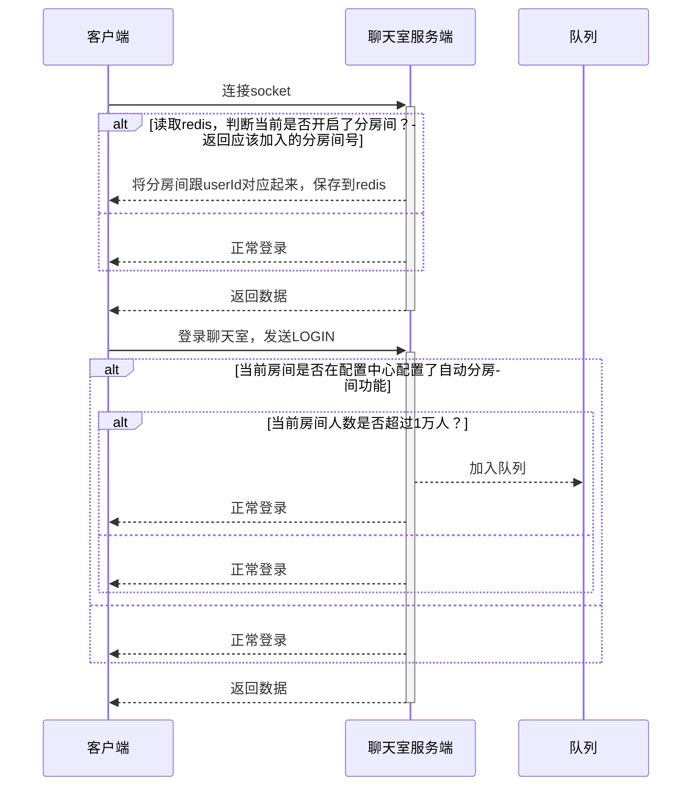

### 聊天室自动分房间设计
> 在一个直播聊天室中，如果每个人发言的消息都会被房间内所有人收到，那当房间人数达到十万时，并发量将达到一百万。为了解决这个问题，需要做分房间。

#### 一、设计思路

```mermaid
 sequenceDiagram
    participant client as 客户端
    participant chat as 聊天室服务端
    participant queue as 队列
    client->>+chat: 连接socket
    alt 读取redis，判断当前是否开启了分房间？返回应该加入的分房间号
        chat-->>client : 将分房间跟userId对应起来，保存到redis
    else
        chat-->>client : 正常登录
    end
    chat-->>-client: 返回数据
    client->>+chat: 登录聊天室，发送LOGIN
    alt 当前房间是否在配置中心配置了自动分房间功能
        alt 当前房间人数是否超过1万人？
            chat-->>queue : 加入队列
            chat-->>client : 正常登录
        else
            chat-->>client : 正常登录
        end
    else
        chat-->>client : 正常登录
    end
    chat-->>-client: 返回数据
```
